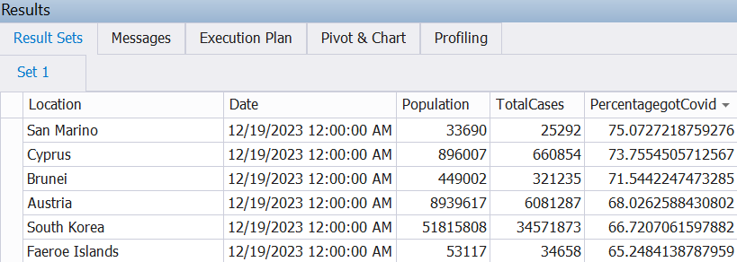
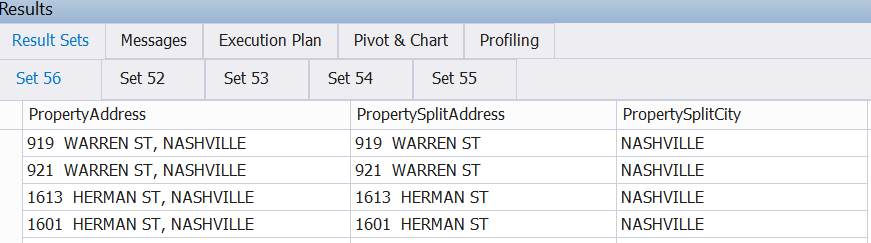

# Data Analysis Repository

Welcome to the Data Analysis repository! This repository is dedicated to exercises and analyses related to SQL, Excel, Tableau, Python, and more. Feel free to explore different branches to find exercises specific to each technology.

## SQL

### Data Exploration

In this dedicated section, we delve into the comprehensive analysis of COVID-19 data using SQL. The query presented here offers valuable insights into various facets of the pandemic, allowing for a nuanced understanding of the situation. Should you be interested in acquiring the data for seamless integration into your database server, you can conveniently access it through the following link: https://covid.ourworldindata.org/data/owid-covid-data.csv. This dataset serves as a rich resource for gaining in-depth knowledge and facilitating meaningful exploration of the ongoing global health crisis.

#### Percentage of Population Affected by COVID-19

```sql

-- Show the percentage of the total population that contracted Covid-19 by country

CREATE VIEW View_PercentageGotCovidByCountry AS
    SELECT
        MAX(location) AS Location,
        MAX([date]) AS 'Date',
        MAX(population) AS Population,
        MAX(total_cases) AS TotalCases,
        MAX(PercentagegotCovid) AS PercentagegotCovid
    FROM
        (
            SELECT
                location,
                [date],
                population,
                total_cases,
                (total_cases / population) * 100 AS PercentagegotCovid
            FROM
                CovidDeaths$
            WHERE continent IS NOT NULL
        ) AS Sub1
    GROUP BY
        Sub1.location;
```
#### Here is an example of the information visualized by the SQL script:

<p align="center">
  
</p>

Feel free to explore and adapt these SQL scripts to gain valuable insights into COVID-19 data. You will find more queries and examples in the SQL file ([SQL/Covid19 Data Exploration.sql](https://github.com/Carlos-Delgado-7/Portfolio-Data-Analyst/blob/main/SQL/Covid19%20Data%20Exploration.sql)). If you have any questions or suggestions, please don't hesitate to reach out. Happy analyzing!

### Data Cleaning

The "NashvilleHousing" data cleaning project aims to enhance the data quality and consistency in the database by identifying and addressing potential issues or inconsistencies. Data cleaning is crucial for maintaining accurate and reliable information. The project involves tasks such as identifying duplicates, correcting formatting errors, handling missing values, normalizing data, validating accuracy, optimizing the schema, and maintaining thorough documentation. These efforts ensure that the database serves as a trustworthy and precise source for queries, analysis, and decision-making. Data cleaning is an ongoing process to address updates and new entries over time.

The data used for this project can be found ([SQL/Data/Nashville Housing Data for Data Cleaning.xlsx](https://github.com/Carlos-Delgado-7/Portfolio-Data-Analyst/blob/main/SQL/Data/Nashville%20Housing%20Data%20for%20Data%20Cleaning.xlsx)).

#### Example of Breaking out Address into individual columns (Address, City, State)

```sql
-------------------------------------------------------------
-- Breaking out Address into individual columns (Address, City, State)

SELECT PropertyAddress FROM NashvilleHousing

SELECT 
    PropertyAddress,
    LEFT(PropertyAddress, CHARINDEX(',', PropertyAddress) - 1) AS StreetName,
    LTRIM(RIGHT(PropertyAddress, LEN(PropertyAddress) - CHARINDEX(',', PropertyAddress))) AS City
FROM dbo.NashvilleHousing
WHERE CHARINDEX(',', PropertyAddress) > 0;
 
 
 ALTER TABLE NashvilleHousing Add PropertySplitAddress Nvarchar(255);
 ALTER TABLE NashvilleHousing Add PropertySplitCity Nvarchar(255);
 
UPDATE dbo.NashvilleHousing
SET 
    PropertySplitAddress = LEFT(PropertyAddress, CHARINDEX(',', PropertyAddress) - 1),
    PropertySplitCity = LTRIM(RIGHT(PropertyAddress, LEN(PropertyAddress) - CHARINDEX(',', PropertyAddress)))
WHERE CHARINDEX(',', PropertyAddress) > 0;

 
SELECT PropertyAddress,PropertySplitAddress, PropertySplitCity  FROM NashvilleHousing

```
#### Here is an example of the data separation by Address and City :

<p align="center">
  
</p>

Feel free to explore and adapt these SQL scripts for the NashvilleHousing data cleaning project. You'll discover more queries and examples in the SQL file (SQL/Nashville Data Cleaning.sql). If you have any questions or suggestions specific to the NashvilleHousing data cleaning effort, please don't hesitate to reach out. Happy data cleaning!
