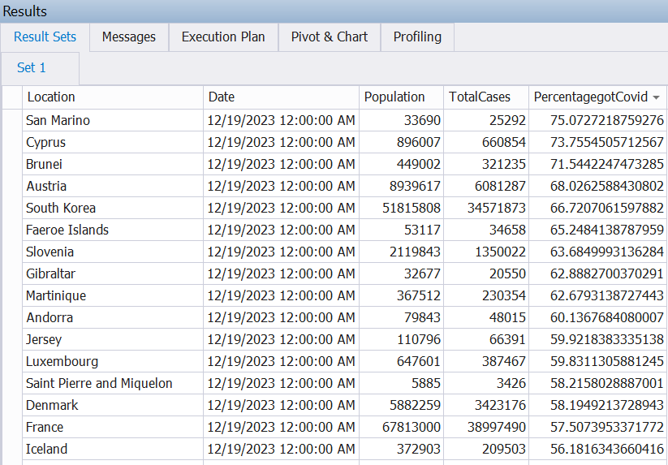

# Data Analysis Repository

Welcome to the Data Analysis repository! This repository is dedicated to exercises and analyses related to SQL, Excel, Tableau, Python, and more. Feel free to explore different branches to find exercises specific to each technology.

## SQL

### Data Exploration

In this section, we delve into the analysis of COVID-19 data using SQL. The following queries provide insights into various aspects of the pandemic:

#### Percentage of Population Affected by COVID-19

```sql
-- Show the percentage of the total population that contracted Covid-19 by country
CREATE VIEW View_PercentageGotCovidByCountry AS
    SELECT
        MAX(location) AS Location,
        MAX([date]) AS 'Date',
        MAX(population) AS Population,
        MAX(total_cases) AS TotalCases,
        MAX(PercentagegotCovid) AS PercentagegotCovid
    FROM
        (
            SELECT
                location,
                [date],
                population,
                total_cases,
                (total_cases / population) * 100 AS PercentagegotCovid
            FROM
                CovidDeaths$
            WHERE continent IS NOT NULL
        ) AS Sub1
    GROUP BY
        Sub1.location;
```
#### Here is an example of the information visualized by the SQL script:

<p align="center">
  
</p>

Feel free to explore and adapt these SQL scripts to gain valuable insights into COVID-19 data. You will find more queries and examples in the SQL file (SQL/Covid19 Data Exploration.sql). If you have any questions or suggestions, please don't hesitate to reach out. Happy analyzing!
